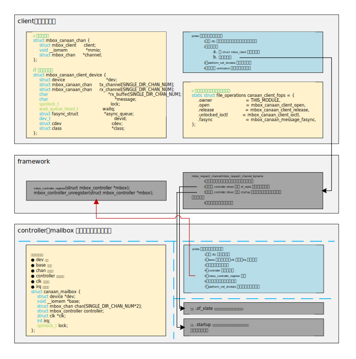
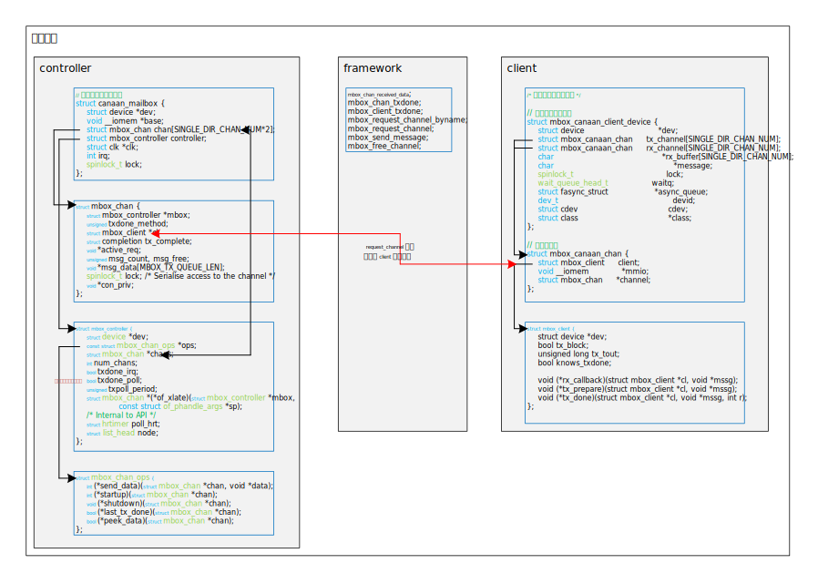
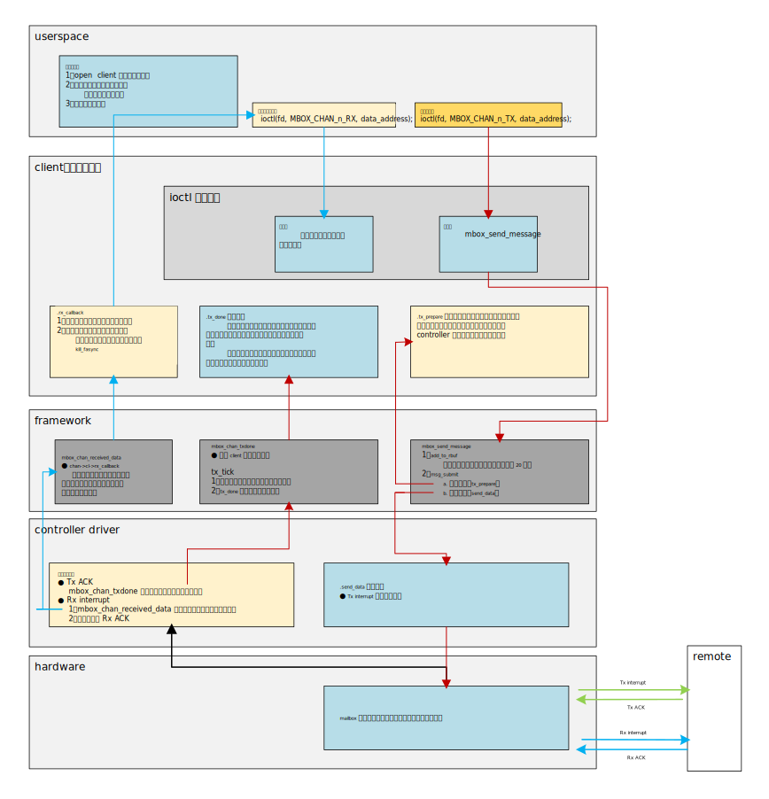
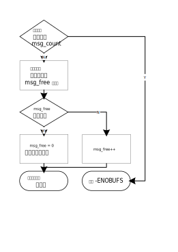

## 13.1 框架分析
### 13.1.1 client、controller 与 framework
&emsp;&emsp;mailbox 框架用于处理多处理器之间的通信。框架分为 controller 与 client。
&emsp;&emsp;controller 是直接操作硬件 mailbox 的驱动。它向下直接操作硬件寄存器，通过发送与接收中断（如果硬件支持）完成与 remote 的通信；向上通过框架提供的接口完成与 client 驱动的交流。 
&emsp;&emsp;client 是 controller 的消费者，向下与 controller 沟通，完成通道申请，数据准备等功能；向上提供可供用户空间操作的接口。
&emsp;&emsp;mailbox 框架所负责的就是 controller 与 client 之间的接口，内核文档中说：“client 和 controller 驱动程序可能是会非常依赖于特定平台的，因此，client 驱动大概率不能在多个平台之间共享”，所以在`/drivers/mailbox`目录下，只能找到有关 controller 的驱动而找不到 client 的驱动，只能找到一个测试 controller 的`mailbox-test.c`的 client 驱动。client 驱动如何与用户空间交换数据也就由驱动开发者自己决定。
&emsp;&emsp;下图是两个驱动注册的基本框架：  
<div align=center>

</div>  

### 13.1.2 数据结构
&emsp;&emsp;controller 与 client 的数据结构如下图所示：
<div align=center>

</div>

&emsp;&emsp;框架中使用`struct mbox_controller`抽象 mailbox 控制器，使用`struct mbox_chan`抽象通道，使用函数集合`struct mbox_chan_ops`来对通道进行操作。上面三个数据结构是针对 controller 的。框架使用`struct mbox_client`抽象客户端，是针对 client 的。  
&emsp;&emsp;除此之外，我们需要针对我们的设备与驱动定义一个我们自己的设备结构体，如上图所示。client 与 controller 的联系是通过在 client 中申请通道时，在`mbox_request_channel`函数中完成的，一个通道绑定一个`struct mbox_client`结构体。

### 13.1.3 函数调用流程
&emsp;&emsp;函数调用流程如下图所示：
<div align=center>

</div>  

&emsp;&emsp;用户空间与 client 驱动的数据传递使用 ioctl 加异步通知的方式，这一部分内容由驱动开发者自己决定，不属于框架的内容。
&emsp;&emsp;我们在 client 驱动中创建了设备节点`/dev/mailbox-client`，用户空间通过此文件进行数据读取与发送。8 个发送通道，8 个接收通道。
#### 13.1.3.1 发送数据流程
&emsp;&emsp;如上图所示：
1. 用户空间操作文件句柄发送数据；
2. 进入 client 驱动的 ioctl 函数，此函数将用户空间数据复制到内核空间，最终调用了`mbox_send_message`函数；
3. 此函数的具体处理流程可以看后面章节的代码分析，主要就是调用了两个回调函数：client 驱动实现的`tx_prepare`，controller 驱动实现的`send_data`。看名字就可以知道这两个函数的作用。需要注意的是，有些硬件的 mailbox 是有硬件数据传输寄存器的，那么此时，数据传输就可以在`send_data`中完成；有些硬件没有硬件数据传输寄存器，那么也可以在`tx_prepare`中完成实际的数据传输，`send_data`的作用就变成了单纯的**触发中断通知远端处理器**；
4. 当远端处理器收到中断，并接收数据以后，需要回复给 controller 一个中断表明 Tx 已经完成；
5. 收到 Tx ACK 以后，controller 注册的中断处理函数需要调用`mbox_chan_txdone`来通知上层本次传输已被远端接收；
6. `mbox_chan_txdone`通过 client 注册的`tx_done`来告知 client 本次传输已完成。由 client 决定后续处理，`tx_done`的参数记录了数据传输的状态。

#### 13.1.3.1 接收数据流程
&emsp;&emsp;如上图所示：
1. 远端处理器发送给 controller 传输数据的中断；
2. 收到中断以后，controller 注册的中断处理函数调用`mbox_chan_received_data`通知上层收到远端传来的数据，并回复给远端 Rx ACK。
3. `mbox_chan_received_data`调用客户端注册的`rx_callback`；
4. `rx_callback`中从设备树指定的地址读取数据，然后使用异步通知的方式通知用户空间；
5. 用户空间的异步处理函数中调用 ioctl 读取接收通道的数据。

## 13.2 框架代码分析
### 13.2.1 mailbox_controller.h
&emsp;&emsp;定义了`mbox_controller`（对 mailbox 硬件的抽象）、`mbox_chan`（对 channel 的抽象）`mbox_chan_ops`（操作 channel 的回调函数的集合）。
```c
struct mbox_controller {
    /* 此 controller 对应的设备，在 probe 时赋值，dev = &pdev->dev */
	struct device *dev;                  
	const struct mbox_chan_ops *ops;    // 对 channel 进行操作的函数集合
	struct mbox_chan *chans;            // channel 的指针数组，channel 的集合
	int num_chans;                      // 支持的 channel 的个数
    /* 是否支持通过中断来检查 remote 消费了一条消息。
     * 例如：硬件上有一些 TX ACK irq（传输完成后收到中断回复表明传输完成了） */
	bool txdone_irq;                  
    /* 是否支持通过 poll 机制来检查 remote 消费了一条消息。
     * 此标志用于硬件没有 TX ACK irq 机制，但是可以通过查询相关寄存器的某些位
     * 来检查是否完成传输。如果设置了 txdone_irq，此标志位会被忽略 */  
	bool txdone_poll;                   
	unsigned txpoll_period;             // POLL 周期，以 ms 计
    /* controller 驱动中通过此函数返回设备树参数中设定的通道 */
	struct mbox_chan *(*of_xlate)(struct mbox_controller *mbox,
				      const struct of_phandle_args *sp);
	/* Internal to API */
	struct hrtimer poll_hrt;
	struct list_head node;
};

struct mbox_chan {
	struct mbox_controller *mbox;           // 此通道所属的 controller
	unsigned txdone_method;                 // 传输完成的通知方式，在 mailbox.h中定义
    /* 指向占有此 channel 的 client 的指针，client 在 client driver 中声明 */
	struct mbox_client *cl;                 
	struct completion tx_complete;          
	void *active_req;                       // 如果不为 NULL，说明还有数据在传输
	unsigned msg_count, msg_free;           // 在代码中会详细分析
	void *msg_data[MBOX_TX_QUEUE_LEN];
	spinlock_t lock; /* Serialise access to the channel */
	void *con_priv;                         // controller 的私有数据，我用作了channel number
};

/**
 * struct mbox_chan_ops - 控制 mailbox channels 的函数
 * @send_data:	此 API 在 MBOX 驱动中使用, 在原子上下文中尝试在总线上
 *		发送消息. 如果发送的消息被远端接受，则返回0；如果远端还没有读取
 *		上一次的数据，会被拒绝并返回 -EBUSY（这个 -EBUSY 怎么使用还没
 *		看懂）。如果有 TX ACK irq 的话，实际的数据传输完成的通知是由 MBOX 
 *		controller 通过 mbox_chan_txdone 来完成的（在中断中）。此函数
 *      禁止睡眠。
 *      实际上，如果硬件没有发送数据的寄存器，那此函数只进行开始传输数据
 *      的通知。例如触发 remote 的中断，告诉远端开始发送数据了。
 * @startup:	Called when a client requests the chan. The controller
 *		could ask clients for additional parameters of communication
 *		to be provided via client's chan_data. This call may
 *		block. After this call the Controller must forward any
 *		data received on the chan by calling mbox_chan_received_data.
 *		The controller may do stuff that need to sleep.
 * @shutdown:	Called when a client relinquishes control of a chan.
 *		This call may block too. The controller must not forward
 *		any received data anymore.
 *		The controller may do stuff that need to sleep.
 * @last_tx_done: If the controller sets 'txdone_poll', the API calls
 *		  this to poll status of last TX. The controller must
 *		  give priority to IRQ method over polling and never
 *		  set both txdone_poll and txdone_irq. Only in polling
 *		  mode 'send_data' is expected to return -EBUSY.
 *		  The controller may do stuff that need to sleep/block.
 *		  Used only if txdone_poll:=true && txdone_irq:=false
 * @peek_data: Atomic check for any received data. Return true if controller
 *		  has some data to push to the client. False otherwise.
 */
struct mbox_chan_ops {
	int (*send_data)(struct mbox_chan *chan, void *data);
	int (*startup)(struct mbox_chan *chan);
	void (*shutdown)(struct mbox_chan *chan);
	bool (*last_tx_done)(struct mbox_chan *chan);
	bool (*peek_data)(struct mbox_chan *chan);
};

/* 
 * client 要送的消息的 buffer 队列，此队列是循环缓冲区。
 * 'msg_count' 记录缓冲消息的数量；
 * 'msg_free' 是下一条将被缓存的消息的 index。
 * 此缓冲区长度不需要太大，因为每次传输都会触发中断，如果有大量数据需要传输，
 * 终端延迟将会成为瓶颈，而不是缓冲区长度。
 * 此外，mbox_send_message 可以在原子上下文中调用，并且 client 可以在它的
 * 回调函数 tx_done 中发送下一条要发送的数据（tx_done 是传输完成的通知函数）。
 */
#define MBOX_TX_QUEUE_LEN	20
```
### 13.2.2 mailbox_client.h
```c
/**
 * struct mbox_client - User of a mailbox
 * @dev:		此 client 对应的设备
 * @tx_block:		如果 mbox_send_message 在数据传输完之前应该是阻塞的，那么
 *                  设置为 true。
 * @tx_tout:		最大阻塞时间，如果超过此时间，认为传输失败。
 * @knows_txdone:	在可以知道 TX 状态的机器上使用. 如果已经有了 TX_Done/RTR 
 *                  中断，那就不需要此位，置为 false 即可。
 * @rx_callback:	Atomic callback to provide client the data received
 * @tx_prepare: 	原子回调函数，在初始化开始传输的寄存器之前，在此函数中准备
 *                  要传输的数据。
 *                  实际上：如果硬件只负责通知消息已经开始传输（例如触发远端中
 *                  断），而没有实际的数据传输寄存器，那么在此函数中完成实际的
 *                  数据传输（从源地址拷贝到目的地址）。
 * @tx_done:		原子回调函数，通知 client 传输已经完成，可以在此函数中准备
 *                  下一次要发送的数据，见 MBOX_TX_QUEUE_LEN 的注释。
 */
struct mbox_client {
	struct device *dev;
	bool tx_block;
	unsigned long tx_tout;
	bool knows_txdone;

	void (*rx_callback)(struct mbox_client *cl, void *mssg);
	void (*tx_prepare)(struct mbox_client *cl, void *mssg);
	void (*tx_done)(struct mbox_client *cl, void *mssg, int r);
};
```

### 13.2.3 mailbox.c
###### add_to_rbuf
```c
/* 
 * 缓存通道传输的消息。
 * 'msg_count' 记录缓冲消息的数量；
 * 'msg_free' 是下一条将被缓存的消息的 index。
 */
static int add_to_rbuf(struct mbox_chan *chan, void *mssg)
```
&emsp;&emsp;该函数逻辑如下：  
<div align=center>

</div>

###### msg_submit
```c
/* 判断存在有效数据以后，调用准备数据和发送数据的回调函数。*/
static void msg_submit(struct mbox_chan *chan)
{
    ......
    /* 
     * index -= count 是为了取出还未传输的最早缓存的 data
     * 缓存区是环形的，当 index < count 时，需要 + MBOX_TX_QUEUE_LEN - count。
     */
	count = chan->msg_count;
	idx = chan->msg_free;
	if (idx >= count)
		idx -= count;
	else
		idx += MBOX_TX_QUEUE_LEN - count;

	data = chan->msg_data[idx];

    ......
}
```
&emsp;&emsp;该函数逻辑如下：  
<div align=center>

</div>  

###### tx_tick
```c
/* 
 * 此函数的作用应该是更新状态，在 txdone 传输完成函数中调用，或者超时以后
 * 调用此函数。
 * 如果正确传输完成，complete(&chan->tx_complete) 结束此次传输。
 *
 * active_req 在此函数中清空。
 */
static void tx_tick(struct mbox_chan *chan, int r)
{
    ......

	/* 如果缓冲区还有消息，会继续发送下一条，如果没有，
       msg_submit 函数会直接返回 */
	msg_submit(chan);

	/* Notify the client */
	if (chan->cl->tx_done)
		chan->cl->tx_done(chan->cl, mssg, r);

	if (r != -ETIME && chan->cl->tx_block)
		complete(&chan->tx_complete);
}
```
###### mbox_chan_received_data
```c
/* 
 * 此函数的作用是在 controller 驱动接收到远端数据时，调用此函数来通知
 * 上层（client）接收到的数据。通知上层的方式是调用 client 中的回调函
 * 数 rx_callback。
 * @chan: RX chennel
 * @mssg: 数据指针，如果没有传输数据的寄存器，可以为空
 * 
 * 一般在 controller 驱动的中断处理函数中调用，在收到远端传输数据的中断
 * 后调用。
 */
void mbox_chan_received_data(struct mbox_chan *chan, void *mssg)
```
###### mbox_chan_txdone
```c
/* 
 * controller 驱动中通知框架数据传输完成的方式，在 controller 驱动的中
 * 断处理函数中调用，在接收到远端 ACK irq 以后调用。
 * 调用了 tx_tick 来完成状态更新。
 */
void mbox_chan_txdone(struct mbox_chan *chan, int r)
```
###### mbox_client_txdone
```c
/* 
 * 在 client 驱动中完成 tx 状态更新的方式
 * 此函数主要是为了不支持 ACK irq 的芯片服务的。例如，txdone_poll 的方式，
 * 芯片提供 tx 传输完成的标志位，此时，可以在 client 驱动中调用此函数完成
 * tx 状态更新。
 */
void mbox_client_txdone(struct mbox_chan *chan, int r)
```
###### mbox_send_message
```c
/* 
 * 为了 client 驱动准备的向 remote 传输数据的函数。
 * 如果在 client 中设置为 tx_block，此函数会在远端接收数据以后或者超时 
 * tx_out 以后返回。
 */
mbox_send_message(struct mbox_chan *chan, void *mssg)
```
&emsp;&emsp;该函数逻辑如下：  
<div align=center>

</div>  

###### mbox_request_channel
```c
/* 
 * cl：请求通道的 client，在 client 驱动中调用，当客户端驱动声明了一个
 *     struct mbox_client 变量，并为其各个成员赋值以后，调用此函数来
 *     绑定 client 和 chan。
 * index：设备树中的通道的索引，下面会分析。
 * 返回值：如果 client 申请 channel 成功，返回对应 channel 的指针。
 */
struct mbox_chan *mbox_request_channel(struct mbox_client *cl, int index)
{
    ......

	if (of_parse_phandle_with_args(dev->of_node, "mboxes",
				       "#mbox-cells", index, &spec)) {
		dev_dbg(dev, "%s: can't parse \"mboxes\" property\n", __func__);
		mutex_unlock(&con_mutex);
		return ERR_PTR(-ENODEV);
	}

	chan = ERR_PTR(-EPROBE_DEFER);
	list_for_each_entry(mbox, &mbox_cons, node)
		if (mbox->dev->of_node == spec.np) {
			chan = mbox->of_xlate(mbox, &spec);
			break;
		}

	......

    chan->msg_free = 0;
	chan->msg_count = 0;
	chan->active_req = NULL;
	chan->cl = cl;
	init_completion(&chan->tx_complete);

    ......
}
```
&emsp;&emsp;此函数，通过`of_parse_phandle_with_args`来从设备树中获得 index 对应请求的 channel。
* `mboxes`指向节点中 phandle 列表属性名；
* `#mbox-cells`指明 phandle 指向的节点所含的 cell 个数；
* `index`表示 phandle 列表的索引，0 代表第一个 phandle，1 代表第二个 phandle；
* `out_args`存储 phandle 中的参数。

&emsp;&emsp;例如，在我们的设备树中
```c
/* 
 * #mbox-cells 指明了 mboxes 属性只有一个 cell；
 * mboxes 是对应的通道的参数列表，我们将其用作了通道的索引
 * 此时，在 client 中调用上面申请通道的函数时，index = 1，就得到了
 * <&mailbox 1>，然后在 of_xlate 函数中进行处理并返回对应 channel 
 * 的指针。（of_xlate 函数是controller 驱动中注册的回调，可以参看
 * mbox_controller 结构体。）
 */
&mailbox {
    #mbox-cells = <1>;
};

&manage_subsys {
    mailbox_client: mailbox_client@0 {
        mboxes =    <&mailbox 0>, <&mailbox 1>, <&mailbox 2>, <&mailbox 3>,
                    ......
                    <&mailbox 12>, <&mailbox 13>, <&mailbox 14>, <&mailbox 15>;
        mbox-names = "tx_chan_0", "tx_chan_1", "tx_chan_2", "tx_chan_3", 
                    ......
                    "rx_chan_7";                    
};
```
&emsp;&emsp;后面是对通道信息的初始化，包括缓存计数的清零，chan 的 cl 和客户端申请 channel 的 client 绑定，tx_complete 的初始化等。
&emsp;&emsp;该函数逻辑如下：  
<div align=center>

</div>

###### mbox_request_channel_byname
&emsp;&emsp;此函数就是根据 name（mbox-names 属性） 从设备树中获取对应的 mboxes 列表，最后还是调用了 mbox_request_channel 函数申请通道。

###### mbox_free_channel
&emsp;&emsp;通道释放函数，将指定通道的成员清空，如果对应的硬件寄存器需要配置的，实现`shutdown`回调函数。
###### mbox_controller_register 和 mbox_controller_unregister
&emsp;&emsp;顾名思义，没仔细看里面内容。

## 13.3 设备树分析
&emsp;&emsp;示例：
```c
/* controller */
mailbox: mailbox@970e0000 {
    ......
    compatible          = ;
    ......
    #mbox-cells = <1>;
};

/* client */
&manage_subsys {
    mailbox_client: mailbox_client@0 {
        compatible = "mailbox-client";
        mboxes =    <&mailbox 0>, <&mailbox 1>, <&mailbox 2>, <&mailbox 3>,
                    ......
                    <&mailbox 12>, <&mailbox 13>, <&mailbox 14>, <&mailbox 15>;
        mbox-names = "tx_chan_0", "tx_chan_1", "tx_chan_2", "tx_chan_3", 
                    ...... 
                    "rx_chan_4", "rx_chan_5", "rx_chan_6", "rx_chan_7";                    
        reg =   <0x1 0x087ffe00 0x0 0x20>, /* cpu2dsp channel 0 */
                <0x1 0x087ffe20 0x0 0x20>, /* cpu2dsp channel 1 */
                ......
                <0x1 0x087fffc0 0x0 0x20>, /* dsp2cpu channel 6 */
                <0x1 0x087fffe0 0x0 0x20>; /* dsp2cpu channel 7 */
    };
};
```
### 13.3.1 controller
&emsp;&emsp;必须有属性`#mbox-cells`，值至少为 1。它指明了 client 属性`mboxes` cell 的个数。
### 13.3.2 client
&emsp;&emsp;必须有属性`mboxes`，它会提供给驱动通道的信息。
&emsp;&emsp;可选属性`mbox-names`，是`mboxes`的别名。
&emsp;&emsp;可选属性`reg`，mailbox client 与 remote 通信而保留的任何内存的一部分。
### 13.3.3 该属性的使用方法
&emsp;&emsp;`mbox-cells`、`mboxes`、`mbox-names`三个属性是在申请通道时用到的。
```c

/* mailbox.c */
struct of_phandle_args spec;

if (of_parse_phandle_with_args(dev->of_node, "mboxes",
                    "#mbox-cells", index, &spec)) {
    dev_dbg(dev, "%s: can't parse \"mboxes\" property\n", __func__);
    mutex_unlock(&con_mutex);
    return ERR_PTR(-ENODEV);
}

chan = ERR_PTR(-EPROBE_DEFER);
list_for_each_entry(mbox, &mbox_cons, node)
    if (mbox->dev->of_node == spec.np) {
        chan = mbox->of_xlate(mbox, &spec);
        break;
    }

/* controller driver */
static struct mbox_chan *canaan_mailbox_xlate(struct mbox_controller *controller,
                        const struct of_phandle_args *spec)
{
    unsigned int ch = spec->args[0];
    ......
    return &mbox->chan[ch];
}
```
&emsp;&emsp;在这里我们将其用作了通道号，也可以添加别的特定于硬件的信息，具体解释由驱动开发者自行决定。

## 13.4 驱动实现
* dts 配置
&emsp;&emsp;参见上面设备树示例。
* controller
&emsp;&emsp;参考 controller.c
* client
&emsp;&emsp;参考 client.c
* 用户空间程序
&emsp;&emsp;参考 userspace.c
## 13.5 内核文档翻译
### 13.5.1 mailbox.txt
#### 13.5.1.1 介绍
&emsp;&emsp;本文档旨在帮助开发人员编写 client 和 controller 驱动程序的 API。 但在此之前，让我们注意 client（especially）和 controller 驱动程序可能会是非常依赖于特定平台的，因为远程硬件可能是专有的并且实现了非标准协议。 因此，即使两个平台使用，例如，PL320 控制器，client driver 也不能在它们之间共享。 甚至 PL320 驱动程序也可能需要适应某些特定于平台的特性。 因此，API 主要是为了避免为每个平台编写类似的代码副本。 话虽如此，没有什么能阻止远程 f/w 也基于 Linux 并在那里使用相同的 api。 然而，这些都对我们本地没有帮助，因为我们只在客户端的协议级别进行处理。 
&emsp;&emsp;在实施过程中做出的一些选择是这个“通用”框架的这种特殊性的结果。 
#### 13.5.1.2 Controller Driver (See include/linux/mailbox_controller.h)
&emsp;&emsp;分配 mbox_controller 和 mbox_chan 数组。 填充 mbox_chan_ops，mbox_chan_ops 回调中除了 peek_data() 都是必需的。 控制器驱动程序可能会通过获取 IRQ 或轮询某些硬件标志来知道远程已消耗了一条消息，或者它永远不会知道（客户端通过协议知道）。 按优先顺序排列的方法是 IRQ -> Poll -> None，控制器驱动程序应通过 'txdone_irq' 或 'txdone_poll' 或 none 来设置。 
#### 13.5.1.2 Client Driver (See include/linux/mailbox_client.h)
&emsp;&emsp;客户端可能希望在阻塞模式（在返回之前同步发送消息）或非阻塞/异步模式（向 API 提交消息和回调函数并立即返回）下操作。 
```c
struct demo_client {
    struct mbox_client cl;
    struct mbox_chan *mbox;
    struct completion c;
    bool async;
    /* ... */
};

/*
* This is the handler for data received from remote. The behaviour is purely
* dependent upon the protocol. This is just an example.
*/
static void message_from_remote(struct mbox_client *cl, void *mssg)
{
    struct demo_client *dc = container_of(cl, struct demo_client, cl);
    if (dc->async) {
        if (is_an_ack(mssg)) {
            /* An ACK to our last sample sent */
            return; /* Or do something else here */
        } else { /* A new message from remote */
            queue_req(mssg);
        }
    } else {
        /* Remote f/w sends only ACK packets on this channel */
        return;
    }
}

static void sample_sent(struct mbox_client *cl, void *mssg, int r)
{
    struct demo_client *dc = container_of(cl, struct demo_client, cl);
    complete(&dc->c);
}

static void client_demo(struct platform_device *pdev)
{
    struct demo_client *dc_sync, *dc_async;
    /* The controller already knows async_pkt and sync_pkt */
    struct async_pkt ap;
    struct sync_pkt sp;

    dc_sync = kzalloc(sizeof(*dc_sync), GFP_KERNEL);
    dc_async = kzalloc(sizeof(*dc_async), GFP_KERNEL);

    /* Populate non-blocking mode client */
    dc_async->cl.dev = &pdev->dev;
    dc_async->cl.rx_callback = message_from_remote;
    dc_async->cl.tx_done = sample_sent;
    dc_async->cl.tx_block = false;
    dc_async->cl.tx_tout = 0; /* doesn't matter here */
    dc_async->cl.knows_txdone = false; /* depending upon protocol */
    dc_async->async = true;
    init_completion(&dc_async->c);

    /* Populate blocking mode client */
    dc_sync->cl.dev = &pdev->dev;
    dc_sync->cl.rx_callback = message_from_remote;
    dc_sync->cl.tx_done = NULL; /* operate in blocking mode */
    dc_sync->cl.tx_block = true;
    dc_sync->cl.tx_tout = 500; /* by half a second */
    dc_sync->cl.knows_txdone = false; /* depending upon protocol */
    dc_sync->async = false;

    /* ASync mailbox is listed second in 'mboxes' property */
    dc_async->mbox = mbox_request_channel(&dc_async->cl, 1);
    /* Populate data packet */
    /* ap.xxx = 123; etc */
    /* Send async message to remote */
    mbox_send_message(dc_async->mbox, &ap);

    /* Sync mailbox is listed first in 'mboxes' property */
    dc_sync->mbox = mbox_request_channel(&dc_sync->cl, 0);
    /* Populate data packet */
    /* sp.abc = 123; etc */
    /* Send message to remote in blocking mode */
    mbox_send_message(dc_sync->mbox, &sp);
    /* At this point 'sp' has been sent */

    /* Now wait for async chan to be done */
    wait_for_completion(&dc_async->c);
}
```
### 13.5.2 mailbox.txt(bindings)
通用 mailbox controller 和 client 驱动的绑定
通用绑定为 mailobx 驱动程序提供了一种将 mailbox channel 分配给客户端驱动的合适的方法。 
1. Mailbox Controller
必须的属性:
   * #mbox-cells: 必须至少为1. Number of cells in a mailbox specifier.
示例:
```c
	mailbox: mailbox {
		...
		#mbox-cells = <1>;
	};
```

2. Mailbox Client
* 必须的属性:
   * mboxes: List of phandle and mailbox channel specifiers.
* 可选的属性:
   * mbox-names: List of identifier strings for each mailbox channel.
   * shmem : 共享内存区域的（SHM）phandle 列表，此共享内存区域是为了 mailboxs 使用者进程间通信使用的，每个 mailbox 一个。该共享内存可以是为 mailbox client 和 remote 之间的通信而保留的任何内存的一部分。 
示例:
```c
	pwr_cntrl: power {
		...
		mbox-names = "pwr-ctrl", "rpc";
		mboxes = <&mailbox 0 &mailbox 1>;
	};
```
&emsp;&emsp;带共享内存的示例(shmem):
```c
	sram: sram@50000000 {
		compatible = "mmio-sram";
		reg = <0x50000000 0x10000>;

		#address-cells = <1>;
		#size-cells = <1>;
		ranges = <0 0x50000000 0x10000>;

		cl_shmem: shmem@0 {
			compatible = "client-shmem";
			reg = <0x0 0x200>;
		};
	};

	client@2e000000 {
		...
		mboxes = <&mailbox 0>;
		shmem = <&cl_shmem>;
		..
	};

```